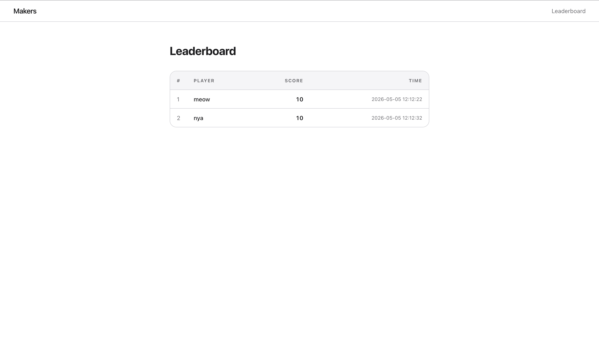
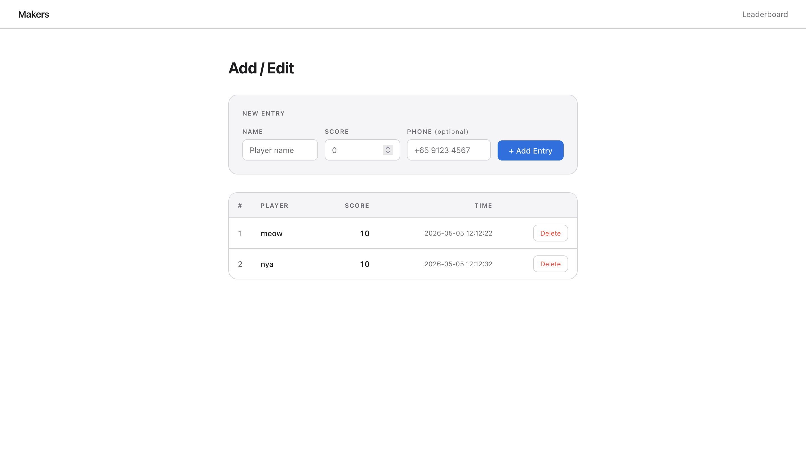

<!-- # Typing-game-leaderboard
guys ples dont use react

Note: make an env file with
FLASK_DATABASE=leaderboard.db
if not me code will break
and i will be very sad

also run py -m flask --app app init-db before starting -->
# Typing Game Leaderboard

## Requirements
- Docker + Docker Compose (my recommendatio)
- Python 3.12+
---

## Running with Docker
 
1. Copy the example env file:
   ```bash
   cp .env.example .env
   ```
   > Edit the credentials accordingly
 
2. Build & start:
   ```bash
   docker compose up --build
   ```
 
3. Open up [http://localhost:8080](http://localhost:8080)

To stop: `docker compose down`
To wipe the database too: `docker compose down -v`
 
---

## Pages
> Im assuming this site is ran locally, so i have yet to implement proper authentication.

### `/lb` — Leaderboard
Displays all player scores sorted by highest score, with live updates via Socket.IO.
 

 
### `/edit` — Add / Edit
Add new entries (name, score, optional phone number) and delete existing ones.
 

 
---

## Relevant Documentation
For your perusal
- https://flask-socketio.readthedocs.io
- https://gunicorn.org/
- https://tailwindcss.com/
- https://docs.docker.com/

